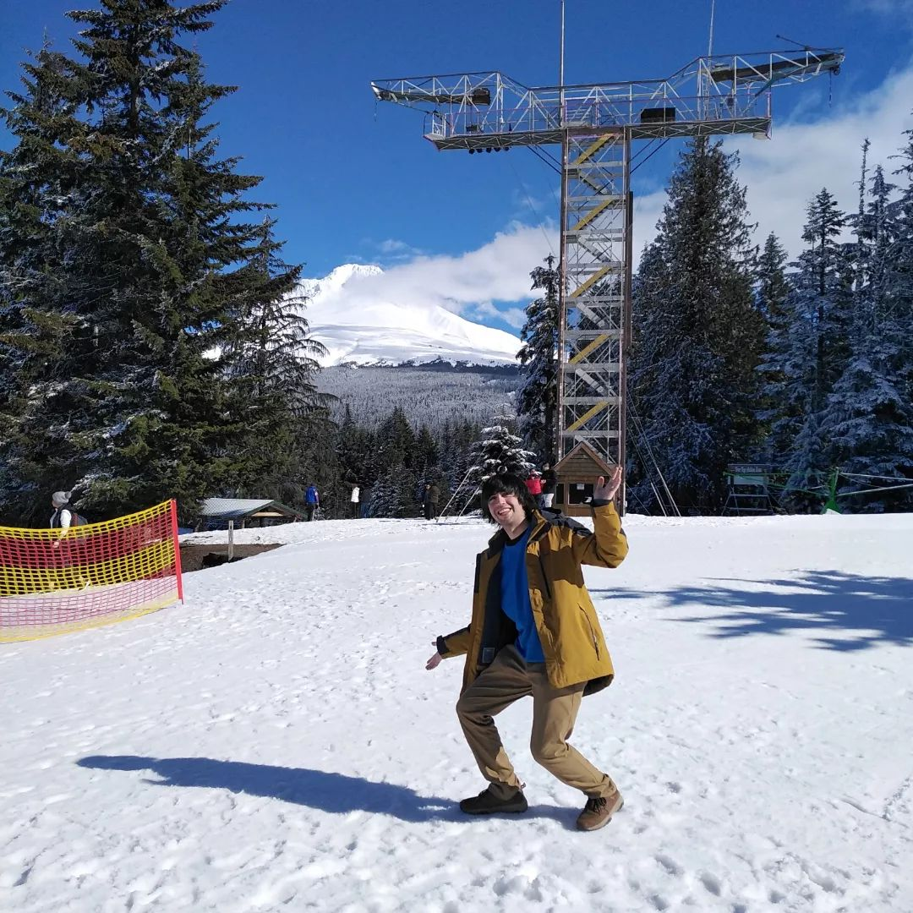

# About me

I’m Gabriel Pinochet Soto, a 25-year-old graduate student at [Portland State University](https://www.pdx.edu/). I’m doing my Ph.D. in Mathematical Sciences; I started in Fall 2021. Previusly, I got my Master and Bachelor degree in Mathematics at [Pontificia Universidad Católica de Valparaíso](https://pucv.cl/). I also attended [IMPA](https://impa.br/)’s summer school in 2019.

I like math. I like (most of) analysis. My current interests are functional analysis, numerical analysis, and numerical methods for differential equations. In particular, I have some work related to numerical methods for production-destruction models and resistivity measurements in axisymmetrical settings.

*Currently*, my favorite Theorems are Grothendieck’s characterization of compact sets in normed spaces, Banach’s fixed point principle, and Arzelà-Ascoli Theorem. My favorite proof is Urysohn’s Lemma proof by indexing separating sets with dyadic numbers.

I also like to play the guitar, pretend I can write songs and poetry, read comics, watch shows, and listen to music while biking around the waterfront. I’ve been living in Portland, Oregon, for almost a year. Previously, I lived in Viña del Mar and Rio de Janeiro.

## Contact

email: [gpin2@pdx.edu](mailto:gpin2@pdx.edu) [gpinochetsoto@anl.gov](mailto:gpinochetsoto@anl.gov)

blog: [homeomorfismo.github.io](https://homeomorfismo.github.io/)

instagram: [@homeomorfismo](https://www.instagram.com/homeomorfismo/)
